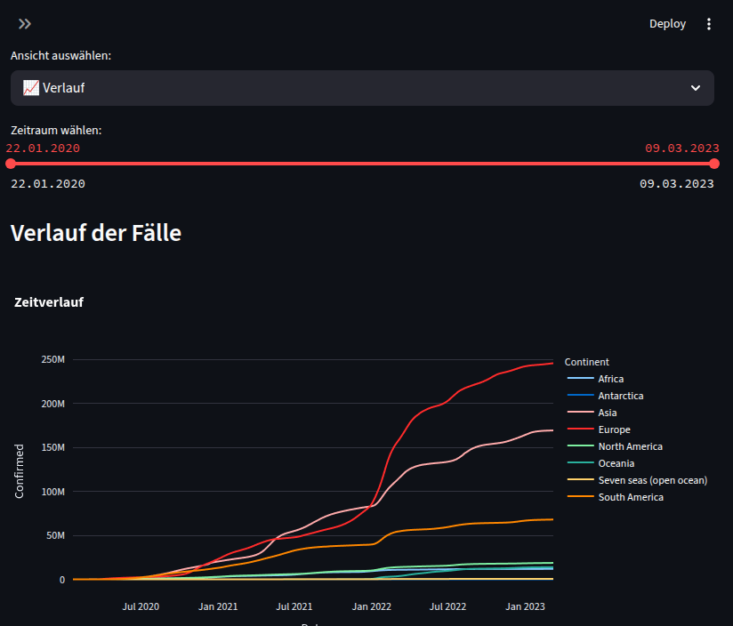
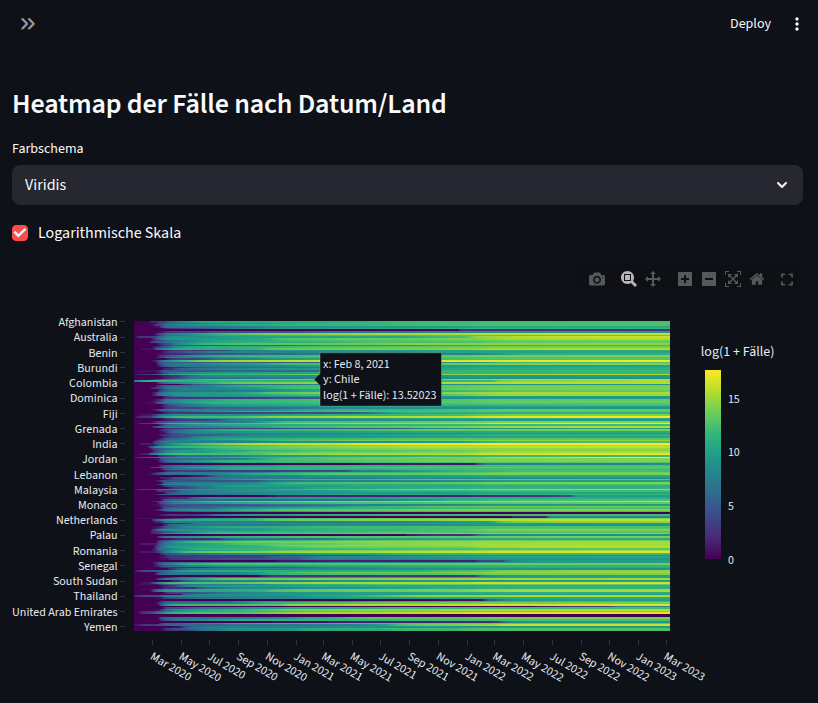
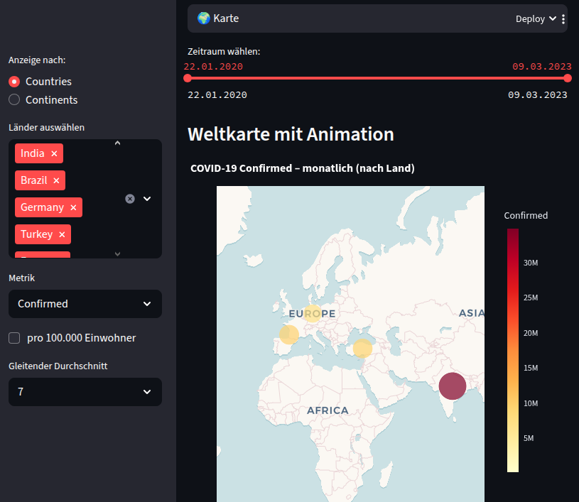
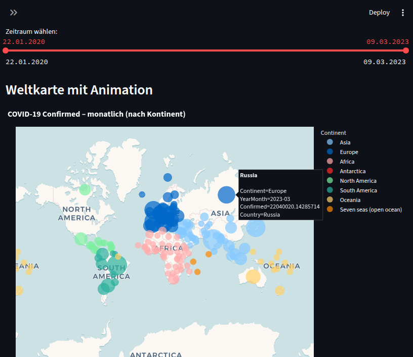
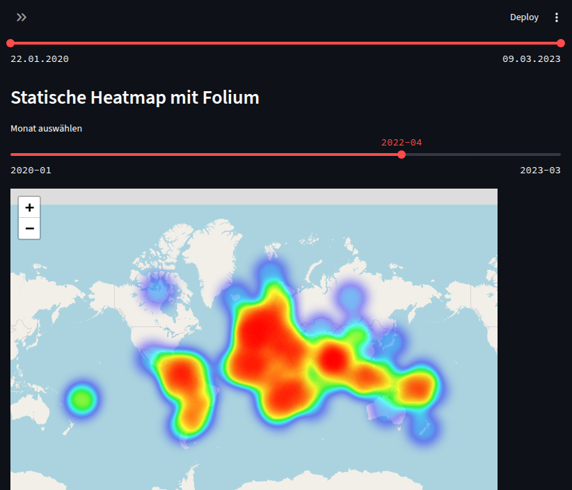

# 🦠 COVID-19 Ultimate Dashboard

Ein interaktives Streamlit-Dashboard zur Visualisierung der weltweiten COVID-19-Daten.  
Das Dashboard lädt Daten von der Johns Hopkins University und ermöglicht verschiedene Ansichten, darunter Zeitverläufe, Heatmaps, Kartenanimationen und CSV-Downloads.

---

## 📋 Features

✅ Automatisches Laden der COVID-19-Zeitreihen (Bestätigte Fälle, Todesfälle, Genesene)  
✅ Länder- und Kontinentauswahl  
✅ Zeitverlauf mit gleitendem Durchschnitt  
✅ Heatmap mit linearer oder logarithmischer Skala  
✅ Interaktive Weltkarte mit monatlicher Animation  
✅ Pro-Kopf-Darstellung (pro 100.000 Einwohner)  
✅ CSV-Export der gefilterten Daten

---

## 🚀 Installation

### Repository klonen
```bash
   git clone https://github.com/wm87/covid_app.git
   cd covid_app
```

### Python-Umgebung erstellen (optional, empfohlen)

```bash
python -m venv venv

source venv/bin/activate  # Linux/macOS
venv\Scripts\activate     # Windows
```

### Abhängigkeiten installieren

```bash
pip install -r requirements.txt
```

### 🌍 Shapefile vorbereiten
Für die Weltkarte wird ein Shapefile benötigt:

* Lade die Natural Earth Shapefile herunter:
ne_10m_admin_0_countries.zip

* Entpacke sie in dein Projektverzeichnis.

* Passe ggf. den Pfad in der Variable NE_SHAPEFILE_PATH an:

```python
NE_SHAPEFILE_PATH = "ne_10m_admin_0_countries.shp"
```

## ⚙️ Starten
```bash
streamlit run covid_dashboard.py
# Ersetze covid_dashboard.py durch den Dateinamen deines Scripts.
```

Streamlit öffnet automatisch den Browser.
Falls nicht, öffne http://localhost:8501.

## 🎛️ Bedienung
In der Sidebar kannst du folgende Einstellungen vornehmen:

* **Anzeige nach**: Länder oder Kontinente

* **Länder/Kontinente auswählen**

* **Metrik**: Confirmed, Deaths, Recovered, New Confirmed

* **Gleitender Durchschnitt**: 7, 14 oder 30 Tage

* **Pro 100.000 Einwohner**

* **Zeitraum**: frei wählbar

### 🖼️ Tabs
1. 📈 Verlauf

   * Liniendiagramm pro Land oder Kontinent

2. 🌡️ Heatmap

   * Heatmap der Fälle über Zeit
   * Optionale logarithmische Skalierung

3. 🌍 Weltkarte

   * Interaktive Scatter Map
   * Animation monatlicher Entwicklungen

4. 📥 CSV

   * Download der gefilterten Daten

5. 📸 Export Hinweis

   * Hinweise zum Speichern der Grafiken als PNG oder SVG

## 📝 Anpassung
Falls du eigene Länder-Kürzel korrigieren möchtest, bearbeite das Dictionary:

```python
country_name_corrections = {
    "UK": "United Kingdom",
    "USA": "US",
    ...
}
```

## 📊 Screenshot's aus der App

### Verlauf



### Heatmap



### Karte mit Plotly (nach Ländern)



### Karte mit Plotly (nach Kontinenten)



### Folium Map



## ❗ Hinweise
* Populationen sind aktuell als Dummy (1.000.000) hinterlegt.
Passe bei Bedarf country_population an.

* Für größere Datenmengen kann die Performance sinken.

* Automatischer Bild-Export ohne Browser ist nicht vorgesehen.

---

## Lizenz

Der Quellcode dieses Projekts steht unter der [Apache License 2.0](LICENSE).

Die verwendeten COVID-19-Daten stammen aus dem  
[COVID-19 Data Repository by the Center for Systems Science and Engineering (CSSE) at Johns Hopkins University](https://github.com/CSSEGISandData/COVID-19)  
und stehen unter der Lizenz [Creative Commons Attribution 4.0 International (CC BY 4.0)](https://creativecommons.org/licenses/by/4.0/).  
Bitte beachten Sie die Anforderungen zur Namensnennung gemäß CC BY 4.0.
